# Bloxstrap-Themes-Collection

 

# Installation Guide
<ol>
  <li>
    Open Bloxstrap and Go to The "Appearance" Tab
  </li>
  <li>
    Make a New Theme and Click "Edit"
  </li>
  <li>
    Click "Open Theme Folder" and Paste the Downloaded Zip's Contents Into It (Click "Replace the file in the destination" if prompted)
  </li>
  <li>
    <b>MAKE SURE "BloxstrapCustomBootstraper" IS SET TO THE CORRECT VERSION (1 = Bloxstrap, 0 = Fishstrap)</b>
  </li>
  <li>
    Click the Save Button and Enjoy!
  </li>
</ol>

 

# Abominationn
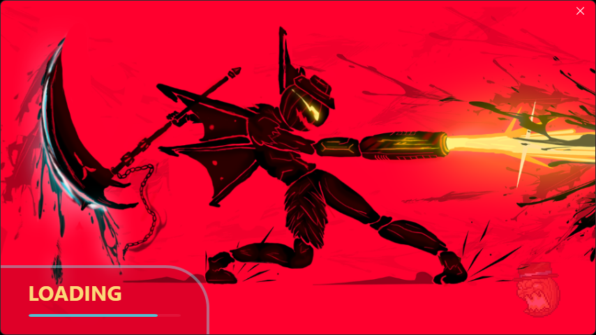

 

# Bocchi The Rock

 

# Celeste
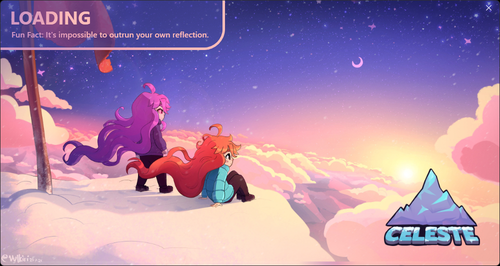
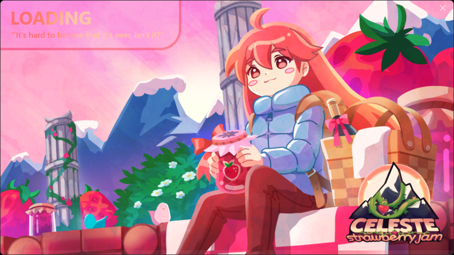

 

# Don Quixote
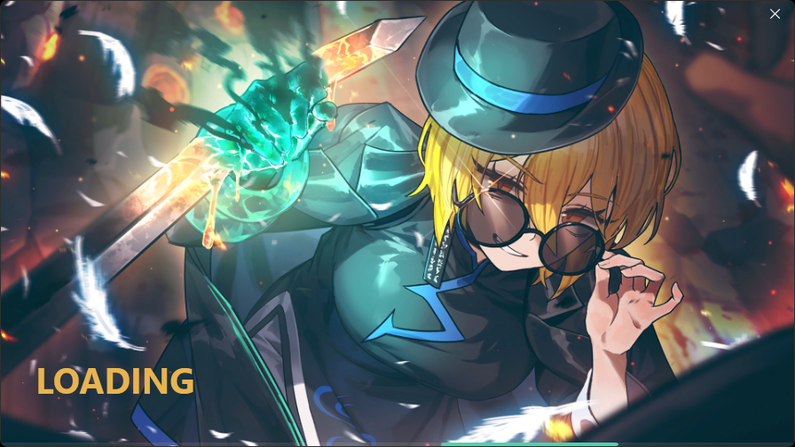

 

# Dusk 
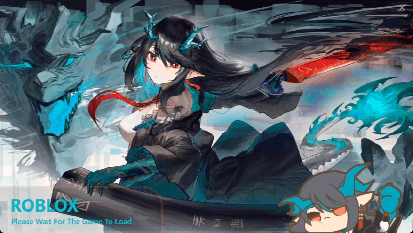

 

# Fargo's
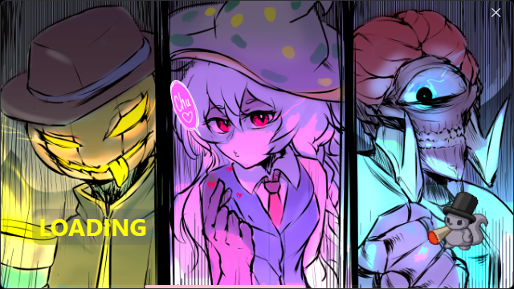

 

# Frieren
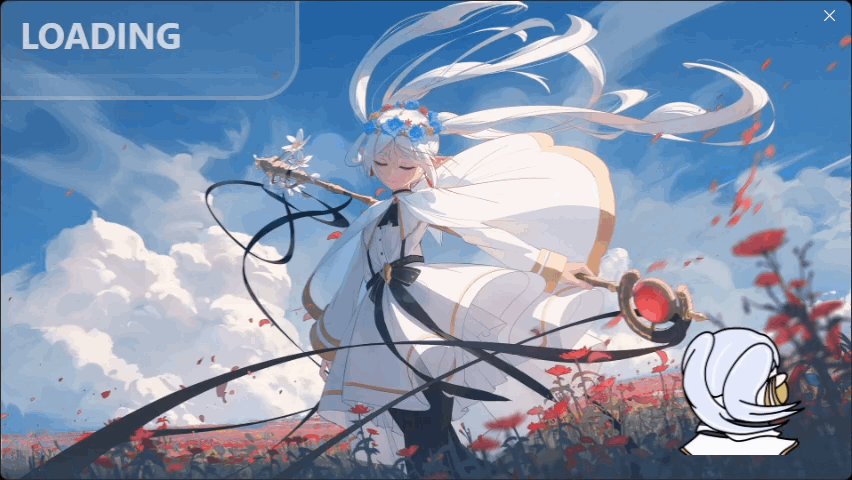

 

# Miyabi
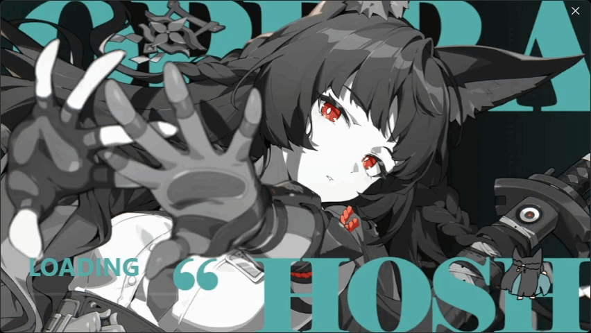
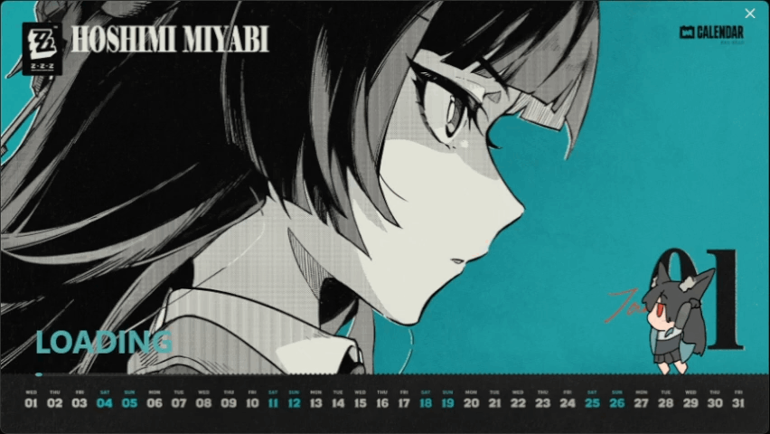

 

# Oneshot

 

# Shikanoko Nokonoko Koshitantan

 

# Two Time
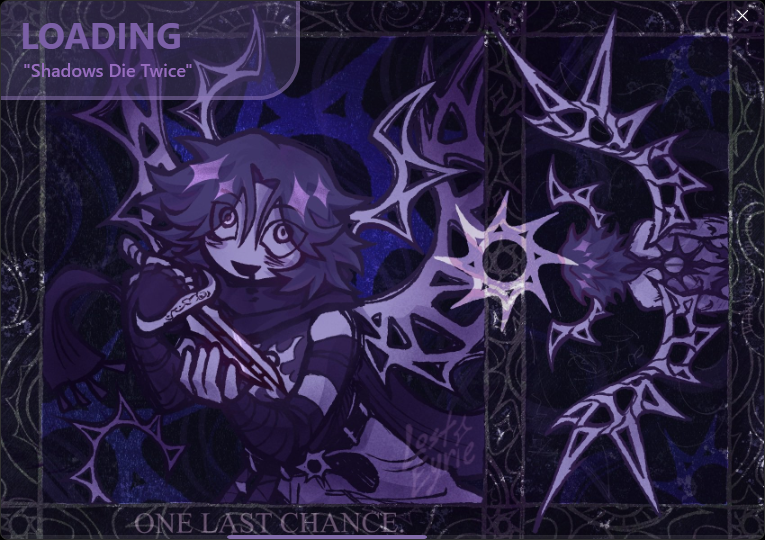

 

# Viper Squadron
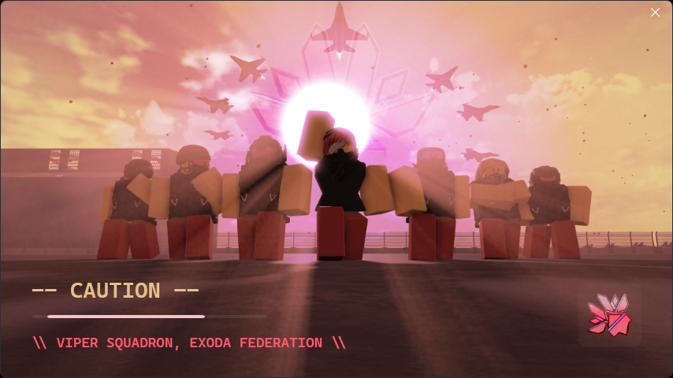
