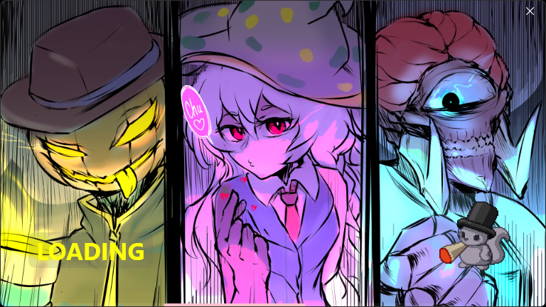
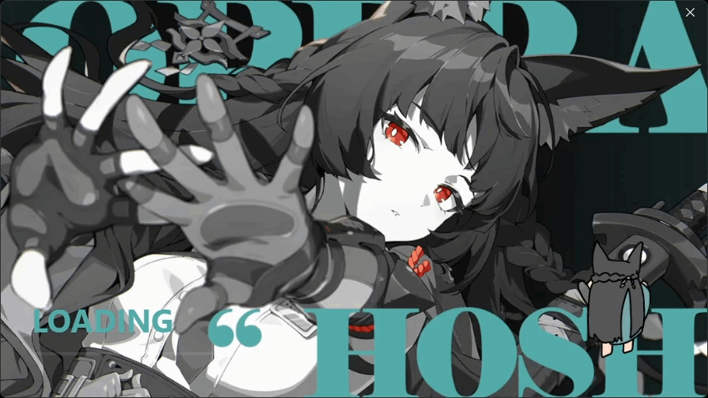

# Bloxstrap-Themes-Collection
<a>I don't feel like updating this💀. More recent themes are in the bloxstrap/fishstrap servers</a>

 

# Installation Guide
<ol>
  <li>
    Open Bloxstrap and Go to The "Appearance" Tab
  </li>
  <li>
    Make a New Theme and Click "Edit"
  </li>
  <li>
    Click "Open Theme Folder" and Paste the Downloaded Zip's Contents Into It (Click "Replace the file in the destination" if prompted)
  </li>
  <li>
    <s><b>MAKE SURE "BloxstrapCustomBootstraper" IS SET TO THE CORRECT VERSION (1 = Bloxstrap, 0 = Fishstrap)</b></s> Nvm lol
  </li>
  <li>
    Click the Save Button and Enjoy!
  </li>
</ol>

 

# Abominationn

 

# Arch Linux

 

# Bocchi The Rock

 

# Celeste

 

# Don Quixote

 

# Dusk 

 

# Fargo's

 

# Frieren

 

# Miyabi

 

# Oneshot

 

# Shikanoko Nokonoko Koshitantan

 

# Two Time

 

# Viper Squadron

